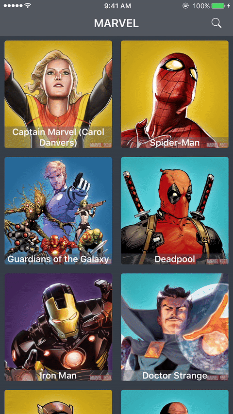
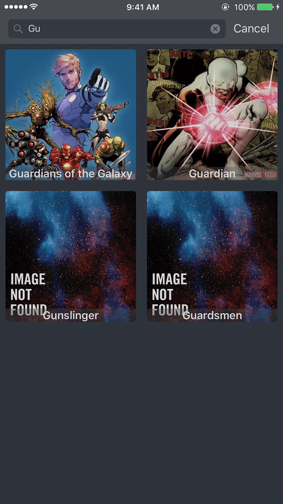

# FFTest
Playing with the Marvel API for a Technical Interview for Farfetch

## Pretty gifs

  
  
  
  

## Challenge
The challenge consists on working with the Marvel API for showing a list of Heroes, searching and favourite them.
The "favourite" feature is yet to develop.

## Try it out
Before running on your device/simulator you need two things, a public and private key from the [Marvel API](https://developer.marvel.com/) (It's free for 3k requests per day).

You'll also need to have [CocoaPods](https://cocoapods.org) installed and run `pod install` before bumping into action.

## TODOs
- Missing the "Favourite" feature (persisting the favourited Heroes).

I'm open for ideas also!

## License

Free for all

## Me

| Francisco Amado | [franciscoamado](https://github.com/FranciscoAmado) | [franciscosamado](https://twitter.com/franciscosamado) |
|----|----|--------|
